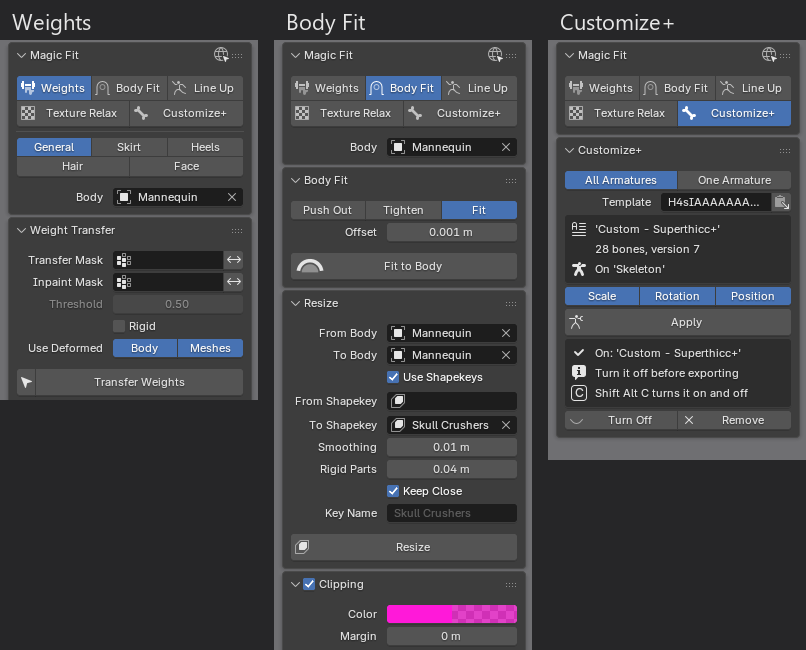
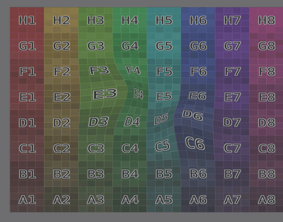

# Magic Fit

A Blender toolkit for Final Fantasy XIV model weighting and fitting. 
Features a weight transfer tool specifically optimized for weighting to FFXIV bodies as well as specialized modes to generate skirt, heel, hair and face weights.
Also comes with a set of brushes to easily and evenly fit clothing to a body without flattening it, resize outfits between body mods and sizes and line up models from other games around FFXIV body proportions. 
It includes a game accurate application of Customize+ templates to any weighted model, including clothing, hair and faces that is handled separate from regular armature posing.

This page only gives a brief overview. The [guide](docs/guide.md) covers every tool and setting in detail.

## Requirements

- **Blender 5.2 or newer.**
- **Weight Transfer needs 64-bit Windows.** It uses SciPy, and the copy that comes with the add-on is built for Blender 5.2 on Windows. Everything else works on any system.
- **A full body with an armature** for the tools that work against a body. Required for weight transfer, line up and fitting.
- **FFXIV installed** on the same computer, for Face Weighting. It reads the game's faces from your install the first time you use it and generates a weight model from those.

## Installation

Add this repository to Blender to install the add-on and get automatic updates:

1. Open **Edit → Preferences → Get Extensions** in Blender.
2. Click **Repositories**, click **+**, and choose **Add Remote Repository**.
3. Add this repository URL:

   ```
   https://raw.githubusercontent.com/link-0402/MagicFit/main/blender_repo/index.json
   ```
4. Tick **Check for Updates on Startup** to get new versions automatically.
5. Find **Magic Fit** in the list and install it. The download is about 32 MB because it includes SciPy, which Blender sets up for you.
6. In the 3D Viewport, press **N** and open the **Magic Fit** tab.

## Features

The sidebar tab has five tabs: **Weights**, **Body Fit**, **Line Up**, **Texture Relax** and **Customize+**. The **Body** you pick below them is shared by every tool that works against a body.



### Weights

**[Weight Transfer](docs/guide.md#weight-transfer)** gives whole meshes the body's weights in one click. Where the mesh lies on the body, it copies the body's weights. Everywhere else, it fills them in smoothly from the weights around them. Fabric between the legs, across the cleavage or under the arms then blends between both sides, so Customize+ scaling and walking don't pinch it or push the body through it.

- It keeps to FFXIV's limit of 8 bones per vertex.
- Hard parts like buckles can be set to **Rigid**, so they never bend.

The **[Weight Brushes](docs/guide.md#weight-brushes)** fix weights where you paint, in Weight Paint mode. Each mode also has a button that does whole meshes:

- **Copy** paints the body's weights onto the mesh, bit by bit.
- **Straighten** fixes fabric that sags into the cleavage or under the breasts once a template makes them bigger. Click where it sags.
- **Smooth** evens out all bone weights at once, even across the gaps between separate parts, so seams stay closed. It needs no body.
- **Skirt** gives skirts and long dresses the weights of FFXIV's skirt bones, so they swing with the game's cloth physics.
- **Heels** makes high heels and boots rigid below the ankle, so heels and soles don't bend.
- **Hair** weights new hair to FFXIV's hair bones. It picks the hair skeleton that fits best and tells you which EST entry to set in Penumbra. When exporting the hair with Instant Edit, this EST setting is automatically written into the mod for you.
- **Face** gives custom faces the weights of the game's face they replace: lids that close in the game's blink, a mouth that moves like the game's, and lashes, teeth and piercings that follow along. Repairs fix just the lids, lashes, mouth, parts or neck, and test poses play the game's blink and expressions.
**Note**: Face Weight mode is experimental and still being worked on for now and may not produce optimal results for sculpts that differ too greatly from the game's faces.  

### Body Fit

**[Body Fit](docs/guide.md#body-fit)** is a sculpt brush for Edit Mode. It pushes clothing out of the body where it clips, pulls loose parts in, or both. All layers move together, so thickness and details survive, unlike with a Shrinkwrap.

**[Resize](docs/guide.md#resize)** moves clothing made for one body to another, such as YAB to Rue, and saves the result as a shape key. The whole outfit moves as one smooth piece, so it doesn't tear where the body changes a lot. A dress that hangs from the breasts keeps hanging from them when they grow.

**[Clipping marks](docs/guide.md#clipping-marks)** show live, in pink, where your meshes clip into the body, even while it's posed or scaled by Customize+.

### Line Up

**[Line Up](docs/guide.md#line-up)** takes a model from other games, turns and poses it so its hips, shoulders and limb joints land on the selected body's. The model keeps its own shape. It reads the common rigs by bone name, and models without a usable armature by their vertex groups.
Only tested against Sims 4, VRChat and Unreal Engine models for the time being. If you encounter an issue with a model from another game, please open an issue to let me know about it so I can extend this feature.

### Texture Relax

**[Texture Relax](docs/guide.md#texture-relax)** is an Edit Mode brush for textures that got stretched or squashed while you edited the mesh. It slides vertices along the surface until the texture is even again, without changing the shape.



### Customize+

**[Customize+](docs/guide.md#customize)** shows a [Customize+](https://github.com/Aether-Tools/CustomizePlus) template on your armatures exactly as the game does, in any pose or animation. Copy the template in Customize+, paste it in the panel and click **Apply**. **Alt Shift C** turns it off and on. The **[Bust Size](docs/guide.md#bust-size)** slider matches the character creator's Bust Size. It never changes your armatures or animations as it uses a separate modifier.
## Good to know

- **Turn Customize+ off before exporting.** Otherwise an exporter that applies modifiers bakes the template into the mesh. Instant Edit's "Reset Armature Scaling" handles this for you.
- **Ctrl Z undoes** every stroke and button.
- **If a brush can't work yet,** for example because no body is picked, its cursor turns dashed and shows why.
- **For hair,** set the EST entry that Hair shows in your mod: in Penumbra, under **Edit Mod → Meta Manipulations**, as an **Extra Skeleton Parameters** entry.
- **For faces,** select the face together with its eyes, lashes and other parts before clicking **Face Weights**.

## Credits

- **Weight Transfer** started as [Robust Weight Transfer](https://jinxxy.com/SentFromSpaceVR/robust-weight-transfer) by [sentfromspacevr](https://github.com/sentfromspacevr) (GPL-2.0-or-later). That add-on implements [Robust Skin Weights Transfer via Weight Inpainting](https://github.com/rin-23/RobustSkinWeightsTransferCode) by Rinat Abdrashitov et al., and parts of their code are used under the MIT License.
- **Bundled libraries:** [SciPy](https://scipy.org) (BSD-3-Clause), [robust-laplacian](https://github.com/nmwsharp/robust-laplacian-py) by Nicholas Sharp (MIT), and the model, Havok and animation readers of [XIVPy](https://github.com/Arrenval/XIVPy) by Arrenval (GPL-3.0), which Face uses to read the game's faces.
- **Customize+:** the template math reproduces [Customize+](https://github.com/Aether-Tools/CustomizePlus) by Aether-Tools, worked out from its source code.
- **Game data:** the skeleton and head data for Customize+ and Hair come from the game's files, through TexTools' skeleton and face exports and Instant Edit's game export, read with Yet Another Addon's reader. The IVCS and YAS bones come from the Yet Another Devkit's skeleton. Only bone positions and a rough head shape are included, none of the game's models. Bust Size uses the game's two bust ranges from its racial scaling table. Face includes none of the game's data: it reads the faces from your own game install and keeps them on your computer.

## License

Magic Fit is licensed under the [GNU General Public License v3.0 or later](magic_fit/LICENSE). To build it from source, run the tests or see how the tools work inside, read the [development notes](docs/development.md).
