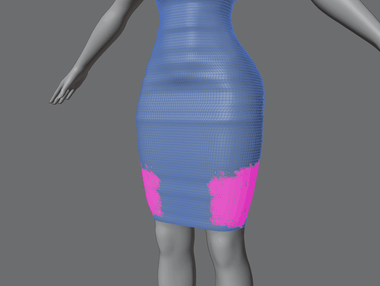

# Magic Fit guide

This guide explains every tool and setting. The [README](../README.md) has the overview and installation.

## The sidebar

In the 3D Viewport, press **N** and open the **Magic Fit** tab. It's there in every mode, with these tabs:

| Tab | What's on it |
| --- | --- |
| **Weights** | [Weight Transfer](#weight-transfer) and the [Weight Brushes](#weight-brushes), sorted into sub-tabs: **General** (Copy, Straighten, Smooth), **Skirt**, **Heels**, **Hair** and **Face**. Each sub-tab has a button for whole meshes first, then its brush. |
| **Body Fit** | The [Body Fit](#body-fit) brush, the [Fit Move](#fit-move) tool, [Resize](#resize) and the [Clipping](#clipping-marks) marks. |
| **Line Up** | [Line Up](#line-up), for models from other games. |
| **Texture Relax** | The [Texture Relax](#texture-relax) brush. |
| **Customize+** | Shows a [Customize+](#customize) template and the game's [Bust Size](#bust-size) on your armatures. |

- **The Body** sits right below the tabs. It's one setting shared by every tool that works against a body. Resize has its own From and To bodies.
- **Each brush panel has a button** that switches the mesh to the right mode and picks the brush: **Paint Weights**, **Paint Skirt Weights**, **Paint Heel Weights**, **Paint Hair Weights**, **Paint Face Weights**, **Fit to Body**, **Fit Move** or **Relax Texture**.
- **The Weights sub-tabs are the brush's modes.** Picking a sub-tab sets the mode, and changing the mode in the tool header switches the sub-tab.
- **The tabs take two rows** in a narrow sidebar. Drag the sidebar wider and they fit in one. Folding the first panel hides the tabs.
- **The globe icon** in the first panel's header has links to Luci_xiv's mods, GitHub, Bluesky and Ko-fi.

The brushes are also regular toolbar tools. **Weight Brushes** is in the Weight Paint toolbar, right after Gradient. **Body Fit**, **Texture Relax** and **Fit Move** are the last three buttons in the Edit Mode toolbar (scroll the toolbar on short screens). While a brush is active, its settings also show in the tool header and under **Properties → Tool**.

Keys for all brushes:

| Key | Action |
| --- | --- |
| LMB drag | Paint or sculpt |
| F / Shift F | Radius / Strength |
| `[` / `]` | Smaller / larger brush |
| Esc or RMB (while dragging) | Cancel the stroke |
| Ctrl Z | Undo a stroke |

If a brush can't work yet (no body picked, a group is missing…), its cursor turns dashed and shows why.

## Weight Transfer

**Weight Transfer** gives whole meshes the body's weights in one go. Use the [Weight Brushes](#weight-brushes) afterwards to fix details.

1. In the **Weights** tab, on the **General** sub-tab, pick the **Body**.
2. Make the mesh active. To do every selected mesh, turn on **Apply to All Selected** (the arrow button left of **Transfer Weights**).
3. Click **Transfer Weights**, in Object or Weight Paint mode.

### How it works

Each vertex is matched to the closest point on the body. Where the mesh lies on the body, it copies the body's weights. Everywhere else, the weights are *inpainted*: filled in as smoothly as the weights around them allow. This means fabric between the legs, across the cleavage or under the arms blends between both sides, and needs no smoothing afterwards.

**Crease Smoothing** (on by default) decides how much each vertex trusts the body under it:

- **On the skin** (within a few millimetres, facing within about 11° of the body), it copies the body's weights. Poses and Customize+ then move it along with the skin.
- **Floating higher**, it only loosely shapes the weights around it. From about 1.3 cm up, it only anchors its loose part.
- **Turning away from the body** (11° to 25°), as where a dress lifts off the butt, it lets go.

So where the mesh spans a crease (the butt cleft, between the legs or breasts, under the bust), the weights of both sides blend smoothly across it. Scaled or posed bones can't fold the fabric into the crease or push the body through it. **Width** (1) sets how far the weights blend. 2 blends twice as far, up to about 4 cm.

- **Hems** trust the body a bit more within 4 cm of a single-layer edge. A hem along a thigh follows the thigh, while a strap across a crease still blends.
- **Hem Follow** tests hems over the legs in four walking strides, plain and with the thighs and butt scaled up. Where a thigh would poke through the hem, the hem takes more of that leg's weights. It needs the thigh bones `j_asi_a_l` and `j_asi_a_r`.

**Pose and Customize+ don't matter.** Meshes that follow the body's armature are matched in the rest pose, so you get the same weights with Customize+ on or off. Other meshes, like gear on its own skeleton, are matched as shown, without Customize+. **Utilities → Inpaint** works on meshes in the same pose.

**Use Deformed** uses shape keys and modifiers: **Body** for the body, **Meshes** for the meshes you transfer to. Modifiers that change the vertex count (Mirror, Subdivision…) must be applied first, or turn **Meshes** off.

**Inpaint Mode** sets how weights spread where nothing matches:

- **Combined** (default) follows the mesh within each loose part, so weights don't jump gaps like the one between loose pant legs. It welds split seams and links separate parts only where they touch, like a lining or a belt.
- **Point** lets weights flow between loose parts, but also across narrow gaps within one part, where they bleed over.
- **Surface** keeps weights within each loose part. It can't fill a loose part that doesn't match the body anywhere.

**Without Crease Smoothing**, a vertex within **Max Distance** whose normal is within **Normal Angle** (30°) of the body's copies the body's weights exactly. **Allow Flipped** also accepts normals facing the other way. Up to **Soft Limit** (90°), vertices pull the weights partway toward the body's. Everything else is inpainted.

### Masks and Rigid

Each mesh has two masks. **Apply to All Selected** ignores them.

- **Transfer Mask**: only transfer where this vertex group has weight. The arrows invert it.
- **Inpaint Mask**: vertices in this group (above **Threshold**) are inpainted instead of copied. **Utilities → Inpaint** uses it on its own, to repair a mesh's existing weights.

**Rigid** (the checkbox below the masks) is for hard parts like buckles, plates or jewellery. All its vertices get the same weights, so the part moves as one piece when posed or scaled.

- It also works with Apply to All Selected, per mesh. Transfer to a coat and its buckles at once, and only the buckles come out rigid.
- Locked groups keep their weights. If they differ between vertices, the part isn't fully rigid.
- A blend of several bones can still stretch it slightly in extreme poses.

### The result

- Each vertex's weights add up to 1 and stay within **Max Groups**. Weights under about 0.002 are dropped, since the game would round them to zero anyway.
- **Locked groups are never changed.**
- The transfer replaces the mesh's bone weights. Bone groups the body doesn't have (like an imported mod's skirt bones) are cleared where it writes, unless locked.
- If anything fails, nothing is written.

**If the transfer stops with an error** about loose parts that can't be filled, **Utilities → Select Rejected Loose Parts** (in Edit Mode) selects them. To fix it, raise Max Distance or Soft Limit, turn on **Virtual Merge** or **Partial Reweight**, or switch from Surface to Combined. With Crease Smoothing, this only happens to a loose part that lies wholly in the Inpaint Mask.

| Option | What it does |
| --- | --- |
| Reset to Defaults | Puts the settings back to their defaults. The body and the masks stay. |
| Inpaint Mode | Combined (default), Point or Surface. See above. |
| Virtual Merge | Treats loose parts closer than this distance as joined, for the solve only. The mesh isn't changed. |
| Seam Sync | Gives nearby open edges of separate loose parts the same weights, so they stay together when bones scale. **Across Objects** includes edges between the selected meshes. The meshes must be single-user. |
| Weights: Normalize | Makes each changed vertex's weights add up to 1. Locked groups are kept. |
| Subset | **Deform Pose Bones** (only groups of the body's deform bones; the body needs an Armature modifier) or **All Groups**. |
| Max Distance | How close to the body a vertex must be to match it. |
| Partial Reweight | Only replace weights near the body. The transfer fades into the old weights over the outer **Falloff** percent (20 %) of Max Distance. |
| Normal Angle, Soft Limit, Allow Flipped | Only used with Crease Smoothing off. See above. |
| Crease Smoothing: Width | Higher blends more smoothly over hollows. Lower follows the body's weights more closely. |
| Smoothing: Repeat, Factor | Smooths the inpainted areas afterwards. Off by default, and only used with Crease Smoothing off. |
| Limit Groups per Vertex: Max Groups | At most this many groups per vertex, counting locked groups and the old weights a Transfer Mask or Partial Reweight blends with. On by default, at 8 for FFXIV (use 4 for VRChat and Unity). Low limits drop the body's smallest groups first, often physics bones. |

### Coming from Robust Weight Transfer

Weight Transfer started as [Robust Weight Transfer](https://jinxxy.com/SentFromSpaceVR/robust-weight-transfer) by sentfromspacevr and has changed a lot since.

- You can uninstall the standalone add-on, since this one does everything it did. Both can also stay enabled side by side and share the same SciPy. Settings like each mesh's masks aren't carried over.
- SciPy loads the first time you transfer, which can take a few seconds.
- There's no Install Dependencies button, since Blender installs SciPy with the add-on.
- Balance L/R, Smoothed Limit Vertex Groups and Visualize Rejected Weights are gone. The transfer limits groups by itself.
- New: the **Combined** Inpaint Mode (the default) and **Rigid** meshes.

## Weight Brushes

The **Weight Brushes** are one Weight Paint tool with several modes: [Copy](#copy), [Straighten](#straighten), [Smooth](#smooth), [Skirt](#skirt), [Heels](#heels), [Hair](#hair) and [Face](#face).

### Copy

**Copy** paints weights from the closest point on a target mesh, usually the body, bit by bit.

1. Select the mesh and switch to **Weight Paint** mode.
2. Pick **Weight Brushes** in the toolbar. Or click **Paint Weights** on the **General** sub-tab, which does both steps.
3. Leave the mode on **Copy**, set the **Target** and choose **All Groups** or **Current Group**.
4. Paint. Each stroke moves the weights under the brush toward the target's. At Strength 1, the brush center copies them exactly.

The brush works on both meshes as you see them, with shape keys, poses and Customize+ scaling. The copied weights then work in every pose. If modifiers change the painted mesh's vertex count (Mirror, Solidify…), the brush goes by its mesh without them, unposed and without shape keys, and warns you. Where clothing floats above the body, it copies the skin underneath; fix those spots with [Straighten](#straighten).

- **Groups are matched by name.** All Groups creates the groups the mesh is missing and lists them.
- **Fade Unmatched Groups** (on) fades out groups the target doesn't have, so painted vertices end up with exactly the target's weights.
- **Deform Bones Only** (on) only copies and fades bone groups. Helper groups, like masks for normals or shape keys, are left alone.
- **Current Group** only changes the active group. The target needs a group with the same name.
- **Locked groups are never changed.** Blender's **Auto Normalize** and **Restrict** are respected.
- **X/Y/Z mirror** also paints the mirrored side, taking `_L` and `_R` weights from the target's matching side. Face and vertex selection masking work too.

| Option | What it does |
| --- | --- |
| Radius, Strength | Brush size in pixels, and how far one stroke moves the weights. The pen icons use tablet pressure. |
| Auto Smooth | Copies the target's weights evened out, so they don't change in hard steps (see [below](#auto-smooth)). Off by default. |
| Falloff: Curve | Smooth, Sphere, Root, Sharp, Linear or Constant, like Blender's brush falloffs. |
| Falloff Shape | **Sphere** affects vertices near the point under the cursor. **Projected** affects everything inside the circle, at any depth. |
| Front Faces Only | Skips vertices facing away from you. |
| Spacing | Distance between dabs, as a percentage of the radius. |
| Accumulate | Off: one stroke moves a vertex at most Strength of the way. On: every pass blends further. |
| Sample | **Nearest Surface** blends the weights at the closest point on the target's faces. **Nearest Vertex** copies the closest target vertex. |
| Max Distance | Leaves vertices alone when the target is farther away than this. |

### Auto Smooth

Copied weights can change abruptly: across a crease, neighbouring vertices copy from spots far apart, and hard edges in the target's weights come along too. Both show as sharp bends when posed.

**Auto Smooth** copies the target's weights evened out over the painted mesh instead. The slider sets how far: at 0.5, a hard edge spreads over about 3 edges, at 1.0 over about 6.

- Where the target's weights don't change, they're still copied exactly.
- The result doesn't depend on how you paint. Going over a spot again doesn't smooth it more.
- Split seams stay closed.
- High values also soften edges the target is meant to have. Use a lower value where those matter.
- It doesn't fix fabric that spans a gap. For that, use [Straighten](#straighten).

### Straighten

Copied weights are right where clothing lies on the skin, but not where it spans a gap. Fabric across the cleavage or under the breasts copies the weights of skin it never touches. Scale the body up (with a Customize+ template, say) and that fabric sags into the crease.

**Straighten** fixes this in the pose you see. Click where it sags, and that part gets weights blended from the parts it hangs between. The fabric then moves with the breasts on either side, in every pose and scaling.

1. Show the pose that makes it sag: apply your template on the [Customize+](#customize) tab, or scale the bones. In the rest pose nothing sags.
2. Set the brush mode to **Straighten** and pick the **Body**.
3. Click where it sags: the middle of the cleavage, under a breast, a strap below a breast. The weights change when you let go. Then click the next spot.

How it works:

- It looks at the surface around the click, about 12 cm on a dress, farther along a narrow strap. A bigger brush looks farther.
- It finds the part there that lies deeper than in the rest pose, and gives it the smoothest weights the weights around it allow.
- The new weights work for every template and pose, and the rest pose looks exactly as before.
- Only bone weights change. Each vertex keeps its total, and locked groups are never changed.
- **Strength** sets how far the weights change (1 is all the way). X mirror and selection masking work too.

If nothing changes, either the mesh is in its rest pose, or nothing there sags. The brush tells you which. Modifiers that change the mesh's vertex count (Mirror, Solidify…) hide its pose from Straighten: turn them off in the viewport first. If it changed too much or too little, undo and click again with another brush size. Skin-tight suits that already follow a crease have nothing to straighten.

### Smooth

Blender's Smooth brush does one group at a time and stops at the edge of each loose part. FFXIV clothing is full of loose parts and split seams, so smoothing one side opens up the seam.

**Smooth** evens out all bone weights at once and reaches across the gaps between parts that touch. It needs no body.

1. In **Weight Paint** mode, pick **Weight Brushes** or click **Paint Weights**.
2. Set the mode to **Smooth**.
3. Paint where the weights should be smoother. Paint again to smooth further.

| Option | What it does |
| --- | --- |
| Reach | How far the weights blend, measured over the surface (2 cm). Small values smooth gently, large ones average a wide area but are slower. |
| Merge Range | Loose parts this close together (2 mm) count as connected, so the brush smooths across the gap. 0 only joins vertices at the same spot. |
| Max Groups | At most this many bone weights per vertex (8). |
| Groups | **All Groups** or only the **Current Group**. |
| Accumulate | Off: each stroke moves weights at most Strength of the way. On: the longer you paint, the smoother it gets. |

- The result doesn't depend on how dense the mesh is or how you paint.
- Each vertex keeps its total weight. Vertices with no weights fill in from their neighbours.
- Layers folded within one part stay apart. Only separate loose parts are joined.
- Distances are measured in the rest pose. Locked groups are never changed.
- SciPy (installed with Weight Transfer) makes it fast. Without it, large Reach values get slow.

If nothing changes, the groups may be locked (the devkit Mannequin's are, on purpose) or not match the armature's bones. If a seam stays visible, the gap is wider than Merge Range: raise it a little, but not so far that it joins separate layers like a jacket over a shirt.

### Skirt

FFXIV swings skirts and long dresses with **skirt bones**: six chains hanging from the hips, `j_sk_{f,s,b}_{a,b,c}_{l,r}` (front, side, back; top to bottom; left, right). Weights copied from a body have none of them. But cloth lying on the thighs and butt still needs body weights, or Customize+ scaling pushes the body through it.

**Skirt** works out the skirt bone weights from where the bones hang and blends them over the body weights.

1. Give the mesh body weights first, with [Weight Transfer](#weight-transfer) or [Copy](#copy).
2. Open the **Skirt** sub-tab and pick the **Body**.
3. Click **Skirt Weights** for the whole mesh (the arrow next to it does every selected mesh), or paint with **Paint Skirt Weights**.

How the weights are worked out, in the rest pose:

- **Height.** Below **Blend Start** (at the hip bone `j_kosi`), the skirt bones take over, fully by **Blend Length** (40 cm) lower.
- **On the body.** Where the cloth lies on the body, it keeps **Skin Weight** (1.0) of its body weights, fading out by **Skin Distance** (7 cm). This keeps Customize+ pushing it out over the thighs and butt. **Body Weight** keeps some body weight everywhere, for dresses that should follow the legs a little.
- **Around the hips,** each spot blends between the two nearest chains. **Spread** sets how far each chain reaches to the side.
- **Down a chain,** the segments blend over **Joint Blend** (10 cm) at each joint.
- **Sleeves, gloves and hair** keep their arm and head weights, however low they hang. Only the rest of a spot's body weight gives way to the skirt bones, and skirt weights a sleeve already has go back to the arm.
- Applying it again changes nothing. Locked groups are never changed. Missing groups are created.

Starting points:

| Look | Skin Weight | Skin Distance | Body Weight |
| --- | --- | --- | --- |
| Like the game's skirts: swings freely (also set Blend Start 10 cm, Blend Length 30 cm) | 0 | | 0 |
| Default: swings freely, but follows Customize+ on the body | 1.0 | 7 cm | 0 |
| Floor-length dress that follows the legs a little | 0.75 | 10 cm | 0.2 |
| Mostly legs, a little swing | 0.75 | 10 cm | 0.6 |

Good to know:

- **The mesh's armature needs the skirt bones.** The brush and button say so if they're missing.
- **Capes and slits:** chains are picked by angle only. Lower Spread to 1, or lock the skirt groups a part shouldn't use.
- **Mirror modifier:** turn on its Mirror Vertex Groups.
- **Max Groups** (8) can push out the smallest body weights, often physics bones like `ya_shiri_phys`.

| Option | What it does |
| --- | --- |
| Blend Start | How far above the hip bone the skirt bones start. |
| Blend Length | How far below Blend Start they fully take over. |
| Skin Weight, Skin Distance | Body weight kept where the cloth lies on the body, fading out at that distance. |
| Body Weight | Body weight kept everywhere below the blend. |
| Spread | How far each chain reaches sideways. |
| Joint Blend | How far a chain's segments blend at each joint. |
| Max Groups | At most this many bone weights per vertex. |

### Heels

Weights copied from a body's feet make a high heel bend like a foot: the heel wobbles and the sole folds. Good heel weights use just two bones: the calf, and the ankle bone holding everything below it rigid.

**Heels** gives a shoe exactly that. It needs no body.

1. Give the shoe body weights first, especially boots, whose shafts keep them.
2. Open the **Heels** sub-tab.
3. Click **Heel Weights** for the whole mesh (the arrow does every selected mesh), or paint with **Paint Heel Weights**.

How it works, in the rest pose:

- **Around the ankle,** the calf hands over to the ankle bone (`j_asi_d`): half each at **Ankle Height** (2 cm above the ankle joint), fully 6 cm lower (**Ankle Blend** / 2).
- **Below that,** heel, sole and toe box all follow the ankle bone.
- **Toe Bend** (0) lets the toe bone bend the front of the foot, for flat shoes and boots. The heel stays rigid either way.
- Above the blend nothing changes. Applying it again changes nothing.

| Shoe | Toe Bend |
| --- | --- |
| High heels, wedges, platforms | 0 |
| Flat shoes, sneakers, boots | 1 |

The Yet Another Devkit also has a **Heel Weights** mesh with calf and ankle weights. You can copy from it with Copy, or with Weight Transfer set to **Subset: All Groups**. It only covers the foot, so boot shafts still need the body's weights.

| Option | What it does |
| --- | --- |
| Ankle Height | Height above the ankle joint where the calf and ankle each get half. |
| Ankle Blend | Height over which the calf hands over to the ankle. |
| Toe Bend | How much the toe bone moves the front of the foot. |

### Hair

FFXIV hair hangs from **hair bones**. Every body has four (`j_kami_a`, `j_kami_b`, `j_kami_f_l`, `j_kami_f_r`). On top of those, each hairstyle can load a **hair skeleton** with its own chains, like `j_ex_h0170_ke_a`. Which skeleton it loads is set by its **EST entry**. A new hair needs weights for those bones and an EST entry with bones where the hair hangs.

**Hair Weights** does both, for hair that has no weights or armature yet. It needs no body: each race's head comes with the add-on.

1. Put the hair where it belongs on the race's head, where TexTools, Instant Edit and Yet Another Addon put imported models. If it has an armature, the head bone `j_kao` can be anywhere, as long as the hair sits on it.
2. Open the **Hair** sub-tab and pick the hair's **Race**.
3. Leave **Skeleton** on **Best Match** and click **Hair Weights**. It:
   - picks the hair skeleton that fits the hair best,
   - adds its bones to the hair's armature (or makes a new **Hair Skeleton** armature),
   - and replaces the hair's weights.

   The arrow next to it treats every selected mesh as one hair. You can also do a split hair one mesh at a time: later parts join the earlier parts' armature and skeleton.
4. The panel shows the **EST entry** to set and which game hairstyles use it. **Also fitting** lists the next best skeletons; click one to use it instead. **Try Another EST Entry** lets you search any entry by number or hairstyle. **Pick** does the same in the settings.
5. Set that EST entry in your mod. In Penumbra: **Edit Mod → Meta Manipulations**, add an **Extra Skeleton Parameters** entry for the hair slot, your race and gender and the hair number, with that entry. 0 means no hair skeleton. The entry is also stored on each mesh as `xiv_est_hair` and `xiv_est_race`, for export tools.
6. To fix a spot, paint with **Paint Hair Weights**. It blends toward the same weights and skeleton.

How the weights are worked out, in the rest pose:

- **Close to the scalp,** hair follows the head. From **Hang Start** (2.5 cm) out, more and more of it hangs from the hair bones: two thirds at **Hang Length** (7 cm) further out.
- **Which chain** is picked by a score fitted on how modders and the game weight hair. Like most modders, it splits long hair at the ears: the back goes to the back chain, the front locks to `j_kami_f_l/r`. Each strand or card goes to one chain as a whole, so strands don't tear apart.
- **Down a chain,** bones blend over at least **Joint Blend** (30 cm). When hair is longer than the chain, **Chain Stretch** (0.5) spreads the joints over its length, so the tips swing with the whole chain.
- **What doesn't hang** is shared between the head, the neck and the upper back. **Neck Weight** (0.3) sets the neck's share.
- **Miqo'te ears:** with **Ears** on, hair that has cat ears gives them to the ear bones (`j_mimi_l/r`). Hair without ears stays with the head.
- **Hair Weights** replaces all weights except locked groups and masks, then removes empty groups. The **Hair brush** only changes bone weights.

Hair where less than 1 % hangs (short hair) gets no hair skeleton, since nothing would swing. Lower Hang Start to let bangs move.

Good to know:

- **Pick the right race.** The same EST number is a different skeleton in each race. Hair for several races needs Hair Weights once per race.
- **Hair in the wrong place** comes out as if it hung free everywhere.
- **Hair Weights replaces all weights.** Lock the groups you want to keep.
- **Check physics in game.** Each skeleton brings its own swing, so try the other matches too.
- **Only the game's own skeletons are known.** A mod with its own hair skeleton file needs its bones weighted by hand.

| Option | What it does |
| --- | --- |
| Race | The race and gender the hair is for. |
| Skeleton | **Best Match** picks the best skeleton. **Pick** uses the EST entry you choose. |
| Hang Start | Hair closer to the scalp than this only follows the head. |
| Hang Length | Two thirds of the hair hangs from the hair bones this far past Hang Start. |
| Neck Weight | Share of the neck and upper back below the head. |
| Chain Stretch | How far long hair spreads a short chain's joints. |
| Joint Blend | The least distance over which a chain's bones blend. |
| Ears | Miqo'te: cat ears follow the ear bones. |
| Max Groups | At most this many bone weights per vertex. |

### Face

FFXIV moves faces with a **face skeleton**: bones for the eyelids, eyeballs, brows, cheeks, nose, lips, jaw and tongue. Each game face has its own skeleton and weights. Custom faces are usually new, denser meshes, so the game's weights can't simply be copied, and hand-painted weights often leave lids that don't close or a mouth that deforms oddly.

**Face Weights** gives a custom face and its parts the weights of the game face it replaces, fitted to its shape. It needs FFXIV installed on the same computer.

**The game's faces.** The first time you use Face, it reads the faces, face skeletons and face animations from your game install. This takes a few seconds. Magic Fit keeps them and only reads them again after a game update, or after TexTools installs or removes mods in the game's files. It never changes the game's files. If a face was read from a mod TexTools installed, the face tools warn you: turn the mod off in TexTools, then click **Read the Game's Faces Again**. It finds the game where XIVLauncher, the game's installer or Steam put it. If not, set **Game Folder** in Magic Fit's preferences (**Edit → Preferences → Add-ons → Magic Fit**, or **Set the Game Folder** in the panel) to the folder with `game` and `boot` in it.

1. Import the face mod with all its meshes (face, eyes, lashes, teeth, piercings), where TexTools, Instant Edit and Yet Another Addon put imported models. With an armature, `j_kao` can be anywhere as long as the face sits on it.
2. Open the **Face** sub-tab.
3. Set the **Game Face**. **Detect** reads it from a name like `c0801f0002` on the object, mesh or material. Without one, it guesses by shape: usually the right race, but often the wrong face number, and the report says so. **Pick** lets you choose the race and face from a list.
4. Select the face and its parts and click **Face Weights**. It adds the face bones to the armature (or makes a new **Face Skeleton**), weights the face and each part, and reports what it did.
5. Check the result with the **Test Poses**: **Blink**, **Shut Eyes** (the game's Shut Eyes expression, which the Bow emote's face uses too), **Talk**, **Shout**, **Angry**, **Clench**, **Ouch**, **Die** and **Salute**. **Rest** puts the bones back.
6. To fix a spot, paint with **Paint Face Weights**. For a part, select the face too.

How the face is weighted:

- **Fitting.** Your face is warped onto the game's so the lid edges, lip line and neck opening line up. Each vertex then takes the game face's weights at that spot. An upper lid never gets lower lid weights, and a lower lip never gets upper lip weights.
- **Closing the eyes.** The game's **Shut Eyes** expression holds the lids about as far closed as its blink goes, for as long as it lasts. With **Close Eyes** on, your lids are made to just meet there, all along the eye. Where the eye still shows, the lid weights are raised. Where the lids would meet much earlier (smaller eyes than the game's) or press into each other, they'd slide past each other and fold while the eyes stay shut, so they're lowered, bit by bit across the eye, but not so far that the blink leaves more than a hairline gap. On faces with more detail than the game's, the lid weights are smoothed too, so the closed lid doesn't crumple. The report says how well the lids meet.
- **The neck.** With **Match Neck** on, the neck opening gets the game's positions, normals and weights, so no seam shows against the body.
- **Parts** are weighted by what they are:
  - **Eyeballs** follow the eyeball bones.
  - **Lashes** follow the lid they grow from, taking the weights of the skin under their roots, so they stay on it as it closes. Their tips lag slightly, like the game's.
  - **Films and tear lines** over the eye stretch between the lids.
  - **Brows, makeup and liner** on the skin take the skin's weights.
  - **Teeth and tongue** take the game's mouth weights.
  - **Ears, horns, scales, beards and whiskers** take the game's weights for those parts.
  - **Everything else** (piercings, jewellery) moves as one piece with the skin it's attached to.
  - Meshes weighted mostly to non-face bones (hair, Viera ears, the body) are left out, and reported.
- Only bone weights change, and locked groups are never changed.

The **Face Repairs** fix one thing on a face whose weights are otherwise fine. Select the face and the parts that go with the repair.

| Repair | What it does |
| --- | --- |
| Fix Eyelids | Weights the lids like the game's face, meeting in the Shut Eyes expression, with the lashes and films following them. |
| Snap Lashes | For lashes that float off or sink into the lids: moves them out or in until their roots sit on the lids (plus **Lash Lift** farther out), keeping their shape and where they are along the lid, then weights them. Only lashes far past the lid's edge move along it. Lashes aren't pushed into the skin, at rest or with the eyes shut. Select the face, the lashes and the eyeballs. |
| Fix Mouth | Weights the lips and mouth like the game's face, with teeth, tongue and lip piercings following. |
| Attach Parts | Weights the selected parts to follow the face's current weights. The face keeps its weights. |
| Match Neck | Gives the neck the game's weights, and its opening the game's positions, normals and weights. |

Good to know:

- **Use the face the mod replaces,** the one in its file name. Au Ra and Viera faces 101 to 104 use faces 1 to 4.
- **Select the eyeballs too,** for the repairs as well. The eye openings and lid edges are measured against them; without them, the report warns. Eyeballs too big for the lids poke through when the eyes are shut, and the report says so.
- **Face Weights replaces all bone weights.** Lock the groups you want to keep, or use a repair.
- **NPC faces:** faces 91 and 92 have no eyeball bones, so eyeballs follow the eye bones. Other NPC faces aren't supported.

| Option | What it does |
| --- | --- |
| Game Face | **Detect** finds the game face from names or shape. **Pick** uses the one you choose. |
| Close Eyes | Makes the lids just meet in the game's Shut Eyes expression, without stopping short or sliding past each other. |
| Match Neck | Gives the neck opening the game's positions, normals and weights. |
| Max Groups | At most this many bone weights per vertex. |
| Lash Lift | Snap Lashes: how much farther out from the lid the roots go. Raise it if the lid pokes through the lashes. |
| Game Folder | In the preferences: where FFXIV is installed, if it isn't found by itself. **Read the Game's Faces Again** re-reads them. |

## Body Fit

**Body Fit** sculpts clothing around the body in Edit Mode. It pushes clipping parts out and pulls loose parts in, moving all layers together so thickness and details survive.

1. Select the clothing (one or more meshes) and enter **Edit Mode**.
2. Pick **Body Fit** at the bottom of the toolbar, or click **Fit to Body** on the **Body Fit** tab.
3. Set the **Body**, a **Mode** and an **Offset** (1 mm), the gap to keep between the body and the innermost layer.
4. Sculpt over the areas to fix. Going over a spot again settles it instead of pushing further.

| Mode | What it does |
| --- | --- |
| Push Out | Moves clothing that clips, or sits closer than the offset, out to the offset. |
| Tighten | Pulls clothing that floats farther than the offset in to it. |
| Fit | Both. |

In Push Out or Tighten, hold **Ctrl** to swap them for one stroke.

| Option | What it does |
| --- | --- |
| Offset | Gap between the body and the innermost layer. |
| Radius, Strength | Brush size in pixels, and how much of the remaining way each dab covers. |
| Auto Smooth | Evens out bumps under the brush while sculpting, without wearing down wrinkles (see [below](#body-fits-auto-smooth)). |
| Falloff: Curve | Same curves as the Weight Brushes. |
| Spacing | Distance between dabs, as a percentage of the radius. |
| Keep Together | Folds, wrinkles and other details up to about one and a half times this wide keep their shape: they move as one piece instead of being pressed onto the body. Wider loose bulges are fitted. Layers always keep their distance. Creases narrower than this are bridged rather than filled, and loose clothing spans valleys up to about twice this wide (see [below](#why-it-doesnt-flatten-the-mesh)). |
| Seam Distance | Vertices closer than this always move together, across parts and objects (see [below](#several-objects-and-split-seams)). |
| Max Distance | Tighten and Fit leave parts farther from the body than this alone, like skirts and capes. |
| Selected Only | Only moves selected vertices. Hidden vertices never move. |
| Fade at Hidden | Fades the brush out toward hidden vertices, over **Fade Distance** (2 cm) along the mesh, so what you fit stays joined to them (see [below](#hidden-parts)). |

Good to know:

- **Why Edit Mode?** Add-on brushes can't record undo steps in Sculpt Mode. In Edit Mode, every stroke is a normal undo step.
- **Modifiers that add geometry** (Mirror, Solidify…) are ignored, and the brush warns you.
- **X/Y/Z mirror** in the Edit Mode header sculpts the mirrored side too.
- **Body normals** don't have to be perfect. Inside-out bodies, bodies joined from closed parts of which only some are inside out (a mirrored leg, say) and split UV seams are handled.
- **Split bodies:** the brush fits against one object, so join a split body first. With only part of a body, like a torso, clothing past its open edges is left alone.

### Tight spots

Between the thighs, under the arms and in other narrow gaps, Body Fit keeps each part of the clothing on the side of the body it wraps. A trouser leg settles on its own thigh, even where it hangs past the middle of the gap or has sunk into the other thigh, and isn't dragged toward the middle. With Push Out, which never pulls clothing in, a leg sunk into the other thigh is pushed out of it the shortest way. Clothing that clips deep in one place and floats a little farther on is fitted in both places, at any **Keep Together**.

Clothing lying along the body, like a suit that follows the side of a crease, heads more directly onto the skin under it, so it slides less toward the crease, but only as far as it stays together: where clothing rounds off a crease or dips into one, it isn't pulled apart or bunched up at the crease line. A tight suit lying in a crease narrower than **Keep Together** is still held up a little over its bottom, like clothing spanning it (about 1 mm at 2 cm); lower Keep Together to let it settle all the way in. With Push Out or Fit, clothing stuck inside the body comes out without bunching up in a crease, and a seam allowance folded inside comes out the shortest way. Clothing hanging loose in a hollow, like a shirt under the arm or a suit at the crotch, is pulled into the hollow along it, so it still moves sideways as it settles there, up to about a centimetre.

Where clothing is folded or pinched along a seam in a crease, the brush won't turn its triangles over, unless that's what it takes to get the clothing out of the body. The two sides of a split seam are held back together, so the seam doesn't fold either.

### Hidden parts

Hide what the brush should leave alone (**H** in Edit Mode). With **Fade at Hidden** on, as it is by default, the brush fades out toward hidden vertices instead of fitting right up to them, so the visible part doesn't pull away and leave a step at their edge. Next to the hidden part, the mesh keeps that part's distance from the body. **Fade Distance** (2 cm) away along the mesh it's fitted fully, with a smooth blend in between. Going over the edge again doesn't wear the fade down.

- **Where the hidden part clips,** the visible part next to it clips a little too. Unhide it and fit it as well.
- **With Selected Only,** unselected vertices count as hidden.
- **Separate parts** that only touch the hidden part, like another object or a loose layer, don't fade, unless they're within **Seam Distance** of it. Layers lying over the faded part move with it.

### Several objects and split seams

All meshes in Edit Mode are sculpted together, as if they were one. Strokes cross from one object to the next, and one Ctrl Z undoes all of them.

Vertices closer than **Seam Distance** (0.1 mm) always move by the same amount. Split UV seams, touching parts and parts in different objects stay closed, even in tight spots like the cleavage. The mesh isn't merged.

### Shape keys and poses

Body Fit fits what you see:

- **The body** is used as shown, with its shape keys, pose and modifiers.
- **Your meshes** are used as shown in Edit Mode. With **Shape Key Edit Mode** on (next to the pin in the Shape Keys panel), the other shape keys count too. Armature modifiers shown in Edit Mode count as well.
- The brush moves the **active shape key**. With the Basis active, Blender carries the change over to the other keys.

The panel warns you when a shape key or pose you see in Object Mode isn't shown in Edit Mode.

### Why it doesn't flatten the mesh

A Shrinkwrap moves every vertex onto the same surface, so a thick garment loses its thickness. Body Fit only fits the innermost layer of the clothing. Every layer lying on another one, like the outside of a thick coat, a lining, a hem folded inside or a strap on a top, rides on the layer under it and keeps its distance, however their vertices line up. A layer is never pulled in through a layer under it, even a hidden one. Where a layer lies much farther from the one under it than it usually does (an overlapping panel sunk deep into the body), pushing the panel out doesn't lift the clothing over it off the skin: it only keeps it clear of the panel.

The innermost layer keeps its folds and wrinkles too: a part that needs to move less than what surrounds it, over a stretch up to about one and a half times **Keep Together**, moves with its surroundings, so a fold stays a fold. A loose bulge wider than that is pulled in.

Clothing spanning a crease (the cleavage, under the bust, the butt cleft) bridges it: it's pulled in no deeper than the body would be if smoothed over Keep Together, and moves straight out of the crease or into it, the way the body turns there. Its vertices don't pull apart or bunch up on either side of the crease.

Loose clothing, farther from the body than Keep Together and at least 2 cm, also spans wider valleys, up to about twice Keep Together, instead of sagging into them. A skirt's front settles on both thighs and stays nearly level across the gap between them. It still dips into a wide gap a little, and its front stretches over the middle of the gap (up to about 2.4 times on a skirt 4 mm off thighs 12 mm apart): raise Keep Together to keep it flatter, or use **Max Distance** to leave the skirt alone. Clothing that dips into a crease itself, or lies closer to the body, like a tight suit, still settles into it.

### Body Fit's Auto Smooth

**Auto Smooth** (on, 0.5) evens out bumps the size of a few triangles, like vertices sticking out of the surface, as you sculpt. It smooths the shape the clothing is heading for rather than the mesh itself, so going over a spot again doesn't flatten it further: wrinkles 2 cm apart keep 94 % of their depth (88 % at full Auto Smooth). Every step of the slider smooths a bit more. It works the same in every mode, never moves clothing closer than the offset and keeps layer thickness. Folds only a few triangles wide are smoothed like bumps, so turn it down where those matter.

## Fit Move

**Fit Move** moves the selection in Edit Mode like Blender's Move, but its proportional editing keeps to the mesh. Moving a trouser leg on one inner thigh doesn't drag the other leg along, split seams don't open, and the edge of a hidden part stays joined to it.

1. In Edit Mode, pick **Fit Move** at the bottom of the toolbar, or click **Fit Move** on the **Body Fit** tab.
2. Select the vertices to move. Turn on **Proportional Editing** (**O**) for the area around them to follow.
3. Drag, or press **G**.

| Key | Action |
| --- | --- |
| Drag | Moves the selection. Starting on an unselected vertex selects it first. Click to select, Shift click to add or remove. |
| G | Moves the selection until you click or press Enter. |
| X / Y / Z | Only along that axis. With Shift, only across it. The same key again, or C, frees it. |
| Wheel, Page Up / Page Down | Proportional size |
| Shift | Finer movement |
| Esc or RMB | Cancel |
| F9 | Change the move afterwards, to the exact distance |

How it differs from Blender's Move:

- **Proportional editing reaches along the mesh**, like Blender's Connected Only. The other side of a narrow gap is far away along the mesh, so it stays put. Blender's Move goes by the straight distance and drags it along.
- **Split seams stay closed.** Vertices closer than **Seam Distance** (0.1 mm) move alike, even across objects, and proportional editing reaches across them. Blender's Connected Only stops at a split UV seam and tears it open.
- **Fade at Hidden** (on by default): the vertices next to hidden ones stay in place, and the move eases in over **Fade Distance** (2 cm) along the mesh. However often you move near them, the visible part stays joined to the hidden one. A selection right next to hidden vertices moves only a little; turn Fade at Hidden off to move it anyway.
- **Separate parts**, like another layer that doesn't touch it, only move when they're selected too.
- Proportional editing's on/off, size and falloff curve are Blender's own, in the header, shared with Blender's Move. Connected Only and Projected don't change anything here.
- X, Y and Z are the global axes. Fit Move doesn't snap, take typed numbers or mirror (X/Y/Z mirror); use F9 for exact distances.

| Option | What it does |
| --- | --- |
| Fade at Hidden | Keeps the vertices next to hidden ones in place and eases the move in over **Fade Distance** along the mesh. |
| Seam Distance | Vertices closer than this move alike, across parts and objects, and proportional editing reaches across them. |

## Resize

**Resize** moves clothing from one body to another and adds the result to each mesh as a shape key. The bodies can be two shape keys of one devkit body, like the Yet Another Devkit Mannequin's Rue, Lava or Buff keys. They can also be two different bodies with the same UV layout, like the RueXB devkit's body and the Mannequin.

1. In the **Resize** panel on the **Body Fit** tab, pick the **From Body**, the body the clothing fits now.
2. Pick the **To Body**. Leave it empty to go to another shape key of the From Body.
3. To start from or go to a shape key, turn on **Use Shapekeys** and pick **From Shapekey** and **To Shapekey**.
4. Select all of the clothing's meshes, so its parts stay together, and click **Resize**.

Examples:

| Clothing | From Body | From Shapekey | To Body | To Shapekey |
| --- | --- | --- | --- | --- |
| RueXB to Rue | RueXB devkit's `DefaultFullBodyWeight` | | Mannequin | `Rue` |
| RueXB to YAB | RueXB devkit's `DefaultFullBodyWeight` | | Mannequin | |
| YAB to Rue | Mannequin | | | `Rue` |
| Rue to YAB | Mannequin | `Rue` | | |

Bring in bodies from other files with **File → Append**. The other shape keys of the bodies count as they're set: for Rue with a medium chest, set the Mannequin to Medium first.

**The result** is a new shape key on each mesh, named after the To Shapekey (or **Key Name**). It's turned on, and the mesh's other keys are turned off. Turn it off to compare, set it halfway for an in-between size, or keep fitting it with Body Fit. Resize doesn't change Body Fit's body for you: its report says what to set to check the fit, then fix what still clips with [Body Fit](#body-fit).

**Different bodies are matched by UV map.** Body mods made for the same skin textures (YAB, Rue, RueXB and Lava all use bibo's) share a UV layout, so each spot of the texture is the same spot on both bodies. Resize refuses bodies that don't match well enough, like bibo and Gen3.

How it works:

- **The whole outfit moves as one smooth piece.** Each point follows how the body around it moves. Tight clothing keeps hugging the skin, and loose parts keep their shape. Layers keep their thickness and touching parts stay together. Tools that bind each vertex to its closest body point (Data Transfer, Surface Deform) tear under the breasts and across the cleavage; this doesn't.
- **Large changes are done in small steps,** so cloth doesn't fold where the body changes a lot in a short distance.
- **Bridge Creases** (8 cm) keeps clothing from sinking into creases that get deeper. A dress hanging from medium breasts keeps hanging from large ones instead of wrapping into the fold under them. Skin-tight clothing still follows the skin. 0 turns it off.
- **Rigid Parts** smaller than 4 cm (rings, studs, buckles) move without changing shape. So do meshes set to Rigid in [Weight Transfer](#weight-transfer).
- **Keep Close** (on) brings tight clothing that ended up hanging off the body, or sinking in, back to its old distance.
- The clothing keeps its distance to the body: where it clipped before, it clips about as much after.
- Custom normals turn with the shape, so they need no fixing.

Good to know:

- **From must be the shape the clothing fits.** For clothing made on a real body, resize from that body, not from a devkit's conversion key, which only approximates it.
- **Small details** of the change, like a deeper navel, are smoothed over. Fix what's left with Body Fit.
- **Very large changes** (RueXB to Rue with a medium chest) can leave a few small creases under the breasts.
- **Bridge Creases bridges in a curve.** Raise it (15 cm) to bridge more, but it can push out clothing meant to hug the body.
- **Hanging parts keep their angle.** A necktie that stuck out over large breasts still sticks out over small ones.
- **Split bodies:** join a body's parts into one object first (on a copy).

| Option | What it does |
| --- | --- |
| From Body | The body the clothing fits now. |
| To Body | The body to fit to. Empty: the From Body. |
| Use Shapekeys | Resize from or to shape keys. Off by default. |
| From Shapekey | The From Body's key the clothing fits. Empty: the body as its keys show it. |
| To Shapekey | The To Body's key to fit to. Empty: the body as its keys show it. |
| Smoothing | How widely the body's change is averaged at the skin (about 1 cm). |
| Bridge Creases | Clothing spans creases a ball this size can't roll into. 0 follows the skin everywhere. |
| Rigid Parts | Loose parts smaller than this keep their shape. 0 turns it off. |
| Keep Close | Brings tight clothing back to its old distance from the body afterwards. |
| Key Name | Name of the new shape key. Empty: the To Shapekey's name, the To Body's, or "Resized". |

## Clipping marks

Wherever a mesh you're working on is inside the body, a pink patch shows on the body. The marks update live as you fit, paint, pose or scale bones, and as an animation plays. Turn them on with the checkbox of the **Clipping** panel on the **Body Fit** tab.

Which meshes are checked:

- In **Edit Mode**: every mesh in Edit Mode.
- In **Weight Paint** and other paint modes: the mesh you're painting.
- In **Object Mode** and **Pose Mode**: the selected meshes. To see clipping while posing, select the clothing, then the armature, and enter Pose Mode.

With only part of a body, like a torso, nothing is marked past its open edges.

| Option | What it does |
| --- | --- |
| Clipping (checkbox) | Shows the marks. Saved with the file. |
| Color | Color and opacity of the marks. |
| Margin | Also marks, more faintly, where the mesh is outside but closer than this. |
| In Front | Shows marks through everything, like clipping hidden under outer layers. |

The panel lists each checked mesh with how many vertices clip. Big changes can take a moment to measure; the panel shows "measuring…" meanwhile.

## Line Up

A model from another game, VRChat or The Sims stands in its own pose and size. **Line Up** scales, turns and poses it so its hips, shoulders and every limb joint land on the body's. With **Fit Shape**, it then reshapes the model bone by bone, so it sits around the body without losing its details. Refitting it with [Resize](#resize), [Body Fit](#body-fit) and [Weight Transfer](#weight-transfer) starts from the right place.

1. On the **Line Up** tab, pick the **Body**, such as the devkit Mannequin.
2. Select the model in Object Mode. One of its meshes or its armature is enough: everything on that armature comes along.
3. Click **Line Up**.

The meshes, their shape keys and the armature all change together, and one Ctrl Z undoes it all. You can switch **Stretch Limbs** and **Fit Shape** afterwards in **Adjust Last Operation** (F9).

How it lines up:

- **The torso** turns to face the front, scales to the body's size and moves onto the body's hips.
- **The neck and head** move with the torso and keep the model's own proportions. Rigs put the head joint anywhere from the base of the skull to the jaw, so matching it would stretch the neck.
- **Each arm and leg** turns at its joints to point like the body's. A T-pose ends up in the body's A-pose. **Clavicles** turn with the torso, which already puts the shoulders at the body's height.
- **Hands and fingers** turn to point like the body's, which straightens curled fingers. A finger segment the body doesn't have (FFXIV's thumbs have two) carries on straight, and fingers the body has no bones for are straightened.
- **Stretch Limbs** (off) also stretches the clavicles and each limb segment lengthwise, so the shoulders and every limb joint land exactly on the body's. The stretch eases in from each joint, so a squashed thigh doesn't crease against a stretched shin. A leg without a foot stretches as much as its thigh. Off, limbs keep their own lengths.
- **Feet** keep their angle, so heels stay heels.
- **Tops and bottoms.** A model with arms but no legs (a top) lines up by its shoulders, sized by its arms. One with legs but no arms (a bottom) lines up by its hips, sized by its legs. Either is taken to stand upright like the body.

How Fit Shape reshapes it:

- **Bone by bone.** Each bone of the model gets a little thicker or thinner, turns and moves, the way you'd pose and scale bones by hand. The mesh follows its weights as it follows the armature, so straps, seams and ornaments keep their shape. Where one bone's weights hand over to the next, the mesh neither creases nor tears. Bones change within limits (about 30 % in girth, 6° in turn), so a finger's loop can't balloon.
- **Around the body.** Wherever the body pokes out of the model, by up to about 3 cm, the model moves out over it. Where the model sits outside the body, it's only drawn in when it's within about a centimetre, so skirts, puffy sleeves and other loose parts keep their shape and distance.
- **The innermost layer.** A jacket isn't drawn in onto the shirt under it: only what lies nearest the body counts.
- **As far as the body reaches.** A bone thickens only as far out as the body reaches around it. A skirt hanging from the hips moves out with them instead of growing with them.
- **Small loose parts** (gems, studs, buttons, rings under 4 cm) keep their shape and move as one piece, as with Resize.
- **Not the face or feet.** The head and feet follow the neck and legs but aren't fitted themselves: the model's face isn't the body's neck, and heeled feet aren't flat ones.
- The report says how far the model's surface typically sat from the body's before and after.

How it finds the joints:

- **From bone names.** It knows Unity/VRChat, Mixamo, Unreal, 3ds Max Biped, Rigify, DAZ, VRoid, MMD, The Sims and FFXIV, fingers included. It also reads The Sims' bone names from the hashes some exports name their groups after (bone_1B82D8B2). Extra bones (jiggle, skirt, tail…) go with the bone they hang from.
- **From vertex groups,** when there's no usable armature. This is a few centimetres less exact, so for bodies and skin-tight models, the joints are then checked against the body's shape.
- **Unnamed groups** (bone_00, bone_01…) are sorted by where they lie. Each branch off a hand is a finger: the thumb is the one starting nearest the wrist. The model must stand upright, facing the front or +X. Long skirts weighted to the legs, even unevenly, still sort right, but can pull the hips a few centimetres off.

Good to know:

- **Keep the armature** if the import has one. Bones give exact joints.
- **Bones all at one spot,** as in The Sims' exports, are put where their vertex groups are, so the armature fits the lined-up model.
- **Rigs place joints differently,** so knees can end up a little off.
- **A posed armature is refused.** Clear its pose first (Pose Mode: **Pose → Clear Transform → All**).
- **One model at a time.** Meshes on two armatures are refused.
- **It needs both arms or both legs.** A piece with neither (a corset on spine bones only), or one not shaped like a top or a bottom (a gown's separate skirt starting below the hips), can't be lined up on its own.
- **Objects parented to a bone** follow it, but aren't scaled.
- **Fit Shape changes the model's build** toward the body's: a slim model's hips and thighs fill out, a thick one's slim down where they're close. Up close, it keeps its own look. Turn Fit Shape off to keep the model's own shape.
- **What's left to fit,** like a few millimetres at the collarbones or between the thighs, is for [Body Fit](#body-fit).
- **For FFXIV,** give the meshes the body's weights afterwards with Weight Transfer.

| Option | What it does |
| --- | --- |
| Stretch Limbs | Stretches the clavicles and each limb segment so the joints land on the body's. Off: keeps the model's limb lengths. |
| Fit Shape | Then scales, turns and moves each bone of the model a little, so its surface lies on the body's where the two are close. Off: keeps the model's own shape. |

## Texture Relax

Editing a mesh stretches some triangles and squashes others, and the texture stretches along. **Texture Relax** slides the vertices under the brush along the surface until the texture is even again. The shape doesn't change. It needs no body.

1. Select the mesh (one or more) and enter **Edit Mode**.
2. Pick **Texture Relax** in the toolbar, or click **Relax Texture** on the **Texture Relax** tab.
3. Paint over the stretched spots. Going over a spot again settles it further.

The brush uses the active UV map. Meshes without one are skipped.

- **Areas that are already even don't move,** however dense they are. It keeps the texture density of the area around the spot.
- **Layers close together** stay on their own layer.
- **Open Edges** (mesh borders) can **Slide** along the border (default), move **Free**ly, or **Keep** their place.
- **Seams stay closed**, as in Body Fit. X/Y/Z mirror, Selected Only, shape keys and armatures work as in Body Fit.
- **Across a UV seam,** texture density isn't matched, since the UV map doesn't say how the islands compare. Within an island it is.

| Option | What it does |
| --- | --- |
| Open Edges | What vertices on the border do: slide, move freely or stay. |
| Radius, Strength | Brush size in pixels, and how much of the remaining way each dab covers. |
| Falloff: Curve | Same curves as the other brushes. |
| Spacing | Distance between dabs, as a percentage of the radius. |
| Seam Distance | Vertices closer than this always move together. |
| Selected Only | Only moves selected vertices. Hidden vertices never move. |

## Customize+

Shows a [Customize+](https://github.com/Aether-Tools/CustomizePlus) template on your armatures exactly as the game does, so you can check how clothing sits on a customized character, posed or animated. Body, face and hair can each have their own armature. It never changes your armatures, poses or animations, and it replaces the Bustomize add-on.

1. In Customize+, open the template and click its **Copy** button. A profile's Copy button works too.
2. On the **Customize+** tab, click the paste button next to **Template**. The panel shows the template's name, how many bones it changes and which armatures it applies to.
3. **All Armatures** (default) applies it to every armature with matching bones and takes an earlier template off the others. **One Armature** limits it to the one you pick.
4. Click **Apply**.

- **Alt Shift C** turns it off and on, in any mode. Change the key in the add-on's preferences, or right-click **Turn Off** and choose **Change Shortcut**.
- **Remove** takes the template off for good.
- **Scale**, **Rotation** and **Position** choose which parts to apply (all three by default, like the game). Click Apply again after changing them.
- **Pose and animate freely.** The template stays on top, like in the game.

Good to know:

- **Turn it off before exporting.** Otherwise an exporter that applies modifiers bakes the template in.
- **Meshes added after Apply** aren't included, and changes to the armature's bones or rest pose don't show. Click Apply again; the panel tells you when. Bones that Hair Weights and Face Weights add show right away.
- **Every template version** Customize+ copies can be pasted, including old profiles and raw template JSON.
- **Racial scaling and height** aren't part of a template, so set up the body shape you want in Blender.
- **Armatures with all bones at the origin** (Instant Edit makes these for imported models) can't show a template. Those bones are skipped, and Apply says which.
- It works on armatures from any importer and every race. [race-skeletons.md](race-skeletons.md) lists how the races' skeletons differ.

Behind the scenes, Apply adds a hidden copy of each armature (named like "C+ Skeleton") and a "C+ Armature" modifier on each mesh. The original modifier stays but is switched off. Turning Customize+ off removes these again, leaving everything exactly as before.

### Bust Size

**Bust Size** matches the Bust Size slider of the game's character creator (0 to 100). Tick it, set your character's value and click **Apply**. It works with or without a template. After that, the slider updates right away. **Alt Shift C** turns it off and on along with the template.

At 50, the breasts keep the model's size. At 0 they're about 80–92 % as big, at 100 about 108–120 %, depending on the direction. Lalafells never go below the model's size; Magic Fit recognizes their skeletons and the panel shows "(Lalafell)". It also scales the IVCS and YAS breast bones that modded bodies use. Male characters get no bust size in the game, so leave it off for them.

Mods that change racial scaling (in Penumbra) change these ranges in the game, but not here.
